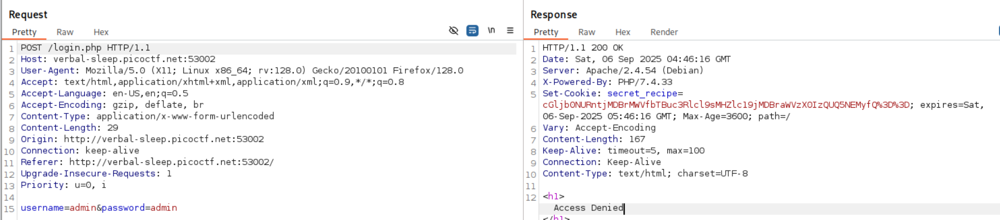
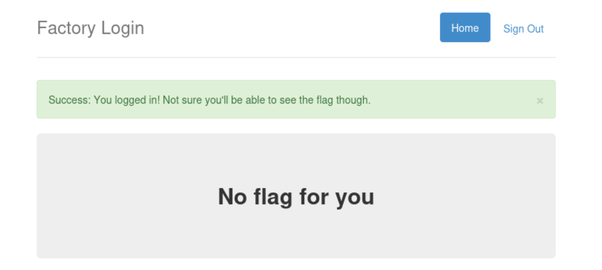

+++
date = '2024-12-01T17:07:19+08:00'
draft = false
title = 'PicoCTF Web Easy Writeup'
+++

# SST1

I made a cool website where you can announce whatever you want! Try it out.


Response header suggests it is a Python web server. It can be either a Twig (PHP) or Jinja2 (Python) templating engine.

Let's go with Jinja first. We can perform SSTI by abusing the MRO function to display classes. The MRO will list the order in which the hierarchy of classes will be handled, we can take advantage of the fact that it lists the classes, to select the one we want. This will help us select the necessary gadgets and chain them to achieve our objective.

What is MRO?
Method Resolution Order (MRO) is the order in which Python looks for a method in a hierarchy of classes. It plays a vital role in the context of multiple inheritance as single method may be found in multiple super classes.

We can see the classes imported into the Python application runtime. Jinja2 was found which confirms our suspicion of the templating engine.


We can perform RCE via SSTI by importing `os` into the Python runtime and using its functions.


Check the current directory, and we see that we are in the web root.


Cat the flag via SSTI RCE


# n0s4n1ty 1

\#file-upload

A developer has added profile picture upload functionality to a website. However, the implementation is flawed, and it presents an opportunity for you. Your mission, should you choose to accept it, is to navigate to the provided web page and locate the file upload area. Your ultimate goal is to find the hidden flag located in the /root directory.

Uploading a file request


http://standard-pizzas.picoctf.net:55056/uploads/
403 - No directory listing

But we can access our uploaded file in the following path. This suggest that the upload directory maybe the same as the web server. We may be able to upload a web shell to perform RCE.
http://standard-pizzas.picoctf.net:55056/uploads/random.png

Wappalyzer suggest that the server is PHP. The response Server header also suggest it.

Upload a simple php web shell


There is no file upload protection and also PHP code can run in the specified directory. We are able to execute PHP in /uploads directory.


We are not able to ls -la /root as our webshell (www-data) is not root. However, we can perform sudo with all commands based on our sudo privileges.


Use sudo to list the /root directory and get the flag


# Cookie Monster Secret Recipe

Cookie Monster has hidden his top-secret cookie recipe somewhere on his website. As an aspiring cookie detective, your mission is to uncover this delectable secret. Can you outsmart Cookie Monster and find the hidden recipe?

This challenge is straightforward. Just attempt a login and then look at the response Set-Cookie header.



Cookie looks like its base64 encoded, just decode it to get the flag.

# WebDecode

Do you know how to use the web inspector?

Again, another straight forward challenge.
view-source:http://titan.picoctf.net:61320/about.html


Base64 decode the attribute value to get the flag.

Challenge suggests to use web inspector. You can view source too. It's good to understand the difference between inspecting and viewing source but thats topic for another day.

# Unminify

I don't like scrolling down to read the code of my website, so I've squished it. As a bonus, my pages load faster!

Another very straight forward challenge simillar to WebDecode. Just view source or inpsect the HTML loaded in the DOM to get the flag.


# IntroToBurp

When we submit the registration form we will be redirected to a page to submit OTP.


We can try to remove the change the request method, remove value of OTP, remove OTP parameter entirely.

To get the flag, remove the body parameter otp=1234. Do note that you should still keep a CRLF at the end the request.


# Bookmarklet

Why search for the flag when I can make a bookmarklet to print it for me?


Copy the Javascript code into Console (Developer's tool) and run it to get the flag displayed in the window pop up.

```js
javascript: (function () {
  var encryptedFlag = "àÒÆަȬë٣֖ÓÚåÛÑ¢ÕÓÉÕËÆÒÇÚËí";
  var key = "picoctf";
  var decryptedFlag = "";
  for (var i = 0; i < encryptedFlag.length; i++) {
    decryptedFlag += String.fromCharCode(
      (encryptedFlag.charCodeAt(i) - key.charCodeAt(i % key.length) + 256) % 256
    );
  }
  alert(decryptedFlag);
})();
```

# Local Authority

Can you get the flag?

Sample login request


Login response discloses some application logic and endpoints.

/admin.php


When we login, the secure.js resource is also fetched from web server.

Try the leaked credentials and we will successfully login and redirected to /admin.php where the flag is displayed
admin:strongPassword098765

# Inspect HTML

Can you get the flag?

Inspect HTML or view the source to get the flag.

# Includes

Inspect the index page source and see that style.css is in the HTML head tag (Network tab will not show it). There is another web resource script.js. Both style.css and script.js contains parts of the flag.

http://saturn.picoctf.net:62734/style.css
http://saturn.picoctf.net:62734/script.js

# Scavenger Hunt

\#apache \#htaccess \#ds_store \#mac

There is some interesting information hidden around this site http://mercury.picoctf.net:44070/. Can you find it?

The index page HTML source contains first page of the flag - picoCTF{t

view-source:http://mercury.picoctf.net:44070/ shows the mycss.css
view-source:http://mercury.picoctf.net:44070/mycss.css has a comment for second part of the flag.

h4ts_4_l0

view-source:http://mercury.picoctf.net:44070/myjs.js has a comment - `/* How can I keep Google from indexing my website? */`

We should check robots.txt
http://mercury.picoctf.net:44070/robots.txt

Third part of the flag: t_0f_pl4c

The response suggests apache server and `Access` with capital 'A'. A quick google search apache server access file will suggest a resource called .htaccess

https://httpd.apache.org/docs/current/howto/htaccess.html

http://mercury.picoctf.net:44070/.htaccess

3s_2_lO0k

The response suggests Mac and Store keywords.
Google What are store files in mac os

https://en.wikipedia.org/wiki/.DS_Store

http://mercury.picoctf.net:44070/.DS_Store

- Part 5: \_7a46d25d}

picoCTF{th4ts_4_l0t_0f_pl4c3s_2_lO0k_7a46d25d}

# Dont-use-client-side

Can you break into this super secure portal? https://jupiter.challenges.picoctf.org/problem/37821/ (link) or http://jupiter.challenges.picoctf.org:37821

Inspect the index page and we will see the flag in the HTML


Rearrange the parts of flag, we just see the `(split, split*2), (split*3, split*4), ...` and so on for the order of the flag fragments.

picoCTF{no_clients_plz_1a3c89}

# logon

The factory is hiding things from all of its users. Can you login as Joe and find what they've been looking at? https://jupiter.challenges.picoctf.org/problem/15796/ (link) or http://jupiter.challenges.picoctf.org:15796

Login with joe:' will redirect you to the /flag
Login with Joe:' will give you invalid login

When we perform a login with a random user, we can see the flow which leads us to GET /flag

https://jupiter.challenges.picoctf.org/problem/15796/flag
But we will not be able to see the flag.



At one point of the authentication flow, we see theres a reflection in the response Set-Cookie header. We may want to try attacks like CRLF injection but lets just go with the simplest vector of adding POST body parameter `admin=true`


We should intercept the login request from the start and add the admin=true into the POST request. However, this will not work. Instead, continue to forward the intercept request. We will see the Cookies with admin=False made for GET /flag. Change it to admin=True and continue to forward the request.


You will get the flag at the end of the flow. If you want to do it in repeater, just add admin=True in the request Cookie header as it is not automatically set.

# Insp3ct0r

Kishor Balan tipped us off that the following code may need inspection: https://jupiter.challenges.picoctf.org/problem/44924/ (link) or http://jupiter.challenges.picoctf.org:44924

Inspect source and we get first part of flag:
picoCTF{tru3_d3

Second part of flag found in: view-source:https://jupiter.challenges.picoctf.org/problem/44924/mycss.css
t3ct1ve_0r_ju5t

Third part of flag found in: view-source:https://jupiter.challenges.picoctf.org/problem/44924/myjs.js
\_lucky?f10be399}

picoCTF{tru3_d3t3ct1ve_0r_ju5t_lucky?f10be399}

# Where are the robots

Can you find the robots? https://jupiter.challenges.picoctf.org/problem/60915/ (link) or http://jupiter.challenges.picoctf.org:60915

https://jupiter.challenges.picoctf.org/problem/60915/robots.txt will review an endpoint /8028f.html

https://jupiter.challenges.picoctf.org/problem/60915//8028f.html will show the flag
