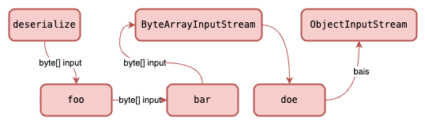
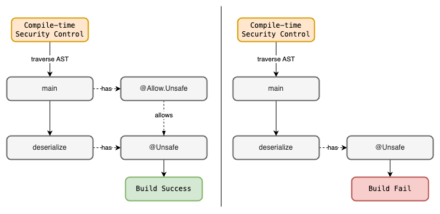

+++
date = '2024-07-11T15:56:35+08:00'
draft = false
title = 'Compile-time Security Controls: Bridging the Gap Beyond SAST'
+++


**Disclaimer:** *I am not a compiler expert. This article's goal is to express the possibility of how we can look at compile-time security controls for Application Security.*


# What is SAST?

Static Application Security Testing (SAST) involves the scanning of static application code before it is compiled. The scan usually involves a parser to check for security vulnerabilities before the code is compiled. 

# The limitations of SAST

SAST scanners will look for known or configured insecure coding patterns by parsing source files. Parsing source files typically involves building an abstract syntax tree (AST) data structure, where each node represents a specific token and its relationship with other tokens. However, the limitation of SAST scanners is the lack of richer semantics of each token.

This limitation arises when third party libraries/packages are used. Consider the following source file main.java:

```java
import thirdparty.library.Helper;

public class Main {
    public static void main(String[] args){
        // ...SNIP...
        String data = Helper.extract(userInfo);
        // ...SNIP...
    }
}
```

When the scanner parses this file, it only builds the AST with tokens available in the source file. In other words, it doesn’t have much knowledge on the third party library tokens like Helper and its method `extract()` other than their token names. If the scanner is robust, it may be able to dynamically resolve the third party library to enrich the AST. However, depending on how the programming language works, resolving third party libraries may only provide links to precompiled classes/objects/binaries from importing these libraries. The scanner may not be robust enough to scan the precompiled classes/objects/binaries to provide richer semantics to the respective tokens in the source file, main.java.

In the example shown, `extract()` may contain some insecure implementation. However, the scanner is not able to detect it because the implementation is not in the source file of the program depending on its package.

In the complex world of programming, third party libraries are commonly used by developers. Adversarial actors can also weaponise this dependency by poisoning libraries with insecure code.

SAST scanners only work with source files in a very static manner. They most probably lack the ability to fully build a semantically rich AST containing all information including third party libraries.


Let’s see another example of how SAST is not able to detect usage of dangerous methods. The code below is a source file that will be parsed and scanned. We see that a third-party library Dslzgator is used to deserialize our serializedData into a UserInfo class.

```Java
import com.dslz.Dslzgator;

public class Main {
    public static void main(String[] args){
        byte[] serializedData = getUserInput();
        UserInfo userInfo = Dslzgator.deserialize(
            serializedData, 
            UserInfo.class
        );
    }
}
```

The scanner will parse and scan the code above without compiling it. At this point, we don’t know if the implementation of `Dslzgator.deserialize()` is safe or not. Scanners are typically not as robust to fully inspect third party libraries because it may be inefficient to scan many layers of the dependency chain.

Let’s take a look at `Dslzgator.deserialize()` implementation.

```Java
package com.dslz;

public class Dslzgator {
    public static <T> T deserialize(byte[] input, Class<T> clazz) {
        T userInfo = null;
        ByteArrayInputStream bais = new ByteArrayInputStream(input);
        ObjectInputStream ois = new ObjectInputStream(bais);  
        userInfo = clazz.cast(ois.readObject());
            
        ois.close();
        bais.close();
        return userInfo;
    }
}
```

Readers with Java security source code review can immediately tell that the `deserialize()` method is vulnerable to Java insecure deserialization attacks. For more information on Java deserialization attacks, take a look at [OWASP Cheatsheet - Deserialization](https://cheatsheetseries.owasp.org/cheatsheets/Deserialization_Cheat_Sheet.html#whitebox-review_2). 

In the case of Java programs, a build tool like Gradle or Maven is typically used for dependency resolution before the Java compiler compiles the program. The dependency resolution is responsible for locating and downloading third-party dependencies.

As mentioned, the limitation of SAST tools is that it only scans code from the parsed source files and not its third party libraries implementation.

## Compile-time Security Controls

We usually think of memory safety checks when we see compile-time security checks. However, we can extend compiler behaviors to check for potential runtime vulnerabilities like Insecure Deserialization, SQL Injections, etc. By performing these checks at the compilation layer, we are able to scan the AST produced during the compilation phase, not the parsing phase.

In the case of Java, the AST during the compilation phase has a richer semantics containing third party libraries implementation due to the dependency resolution. The dependency resolution will import the classes of the third party libraries. These classes contain the implementation of the libraries.

The approach in modeling our detection and handling strategy consists of the following:
1. Identify the root factors that contributes to the vulnerability
2. Determine actions of security control

The following are the requirements for compile-time security controls:
- Compiler able to be extended to custom compiler process
- Programming language able to support processing of metadata such as tags, annotations, etc.

Lets model our detection and handling strategy from the Java code previously mentioned.

Our application code:
```Java
import com.dslz.Dslzgator;

public class Main {
    public static void main(String[] args){
        byte[] serializedData = getUserInput();
        UserInfo userInfo = Dslzgator.deserialize(
            serializedData, 
            UserInfo.class
        );	
    }
}
```

Third-party library code:
```Java
package com.dslz;

public class Dslzgator {
    public static <T> T deserialize(byte[] input, Class<T> clazz) {
        T userInfo = null;
            
        ByteArrayInputStream bais = new ByteArrayInputStream(input);
        ObjectInputStream ois = new ObjectInputStream(bais);    
        userInfo = clazz.cast(ois.readObject());
            
        ois.close();
        bais.close();
        return userInfo;
    }
}
```

The vulnerability in scope is Insecure Deserialization. Java provides the native APIs ByteArrayInputStream and ObjectInputStream for deserialization. The issue with the `deserialize()` method is that there is no validation for the input byte array. Of course a potential patch will be adding a validation step to validate the input before streaming the bytes to an ObjectInputStream.


We can implement a Java compiler plugin that traverses the Java AST and programmatically detect if an non-validated byte array is used for ByteArrayInputStream and ObjectInputStream. From there we can log compilation errors and fail the build.

## Approaching Compile-time Security Controls

From the previous example, we can implement a compile-time security control to explicitly detect the sequential invocation of a series of dangerous APIs/methods. However, such a naive approach only accounts for 1 specific sequence of dangerous APIs/methods. 

Instead, we should consider that there are many ways that these such APIs/methods can be used and lead to a potential vulnerability like Insecure Deserialization. This adds to the complexity of the compile-time security control since it leverages on how the structure of the AST, and the structure of the AST is heavily determined by the code implementation.

Consider our security control specifically checking for the following sequence of methods invoked.


What about other sequences of methods invoked that will still lead to the same vulnerability?




If our security control is tightly coupled to the sequence of methods invoked, then it is only limited to that case. This approach is not viable for implementing the control.

There are 2 simpler approach to implement compile-time security control:
1. Detecting Fully qualified name with method signature
2. Metadata processing of known insecure methods

### Detecting Fully Qualified Method Name and Signature

A simple but naive approach is to traverse the AST and detect for dangerous fully qualified names (package and classpath inclusive) of a method with its signature. With this approach, we don’t consider the sequence of methods called, as we only care if a specific method is present in the AST. However, there are drawbacks to this approach. We lack context of whether the method is used securely or not because some methods are only dangerous when used in conjunction with other methods.

## Metadata processing of known insecure methods

The second approach is to leverage on the language metadata processing capabilities. In the case of Java, we can leverage Java annotations. If the method is known to be unsafe or can be used unsafely, the method can be annotated with an annotation to denote as such.

```Java
package com.dslz;

@Retention(RUNTIME)
@Target(METHOD)
public @interface Unsafe {}

@Retention(RUNTIME)
@Target({METHOD, CONSTRUCTOR, TYPE})
public @interface Allow {
    @Retention(RUNTIME)
    @Target(METHOD)
    @interface Unsafe
}

public class Dslzgator {
    @Usafe
    public static <T> T deserialize(byte[] input, Class<T> clazz) {
        T userInfo = null;
            
        ByteArrayInputStream bais = new ByteArrayInputStream(input);
        ObjectInputStream ois = new ObjectInputStream(bais);    
        userInfo = clazz.cast(ois.readObject());
            
        ois.close();
        bais.close();
        return userInfo;
    }
}
```

The code above is the same `deserialize()` method but this time annotated with the `@Unsafe` annotation. Also note that there is another annotation `@Allow.Unsafe` which is used for the compile-time security control to relax the control.

Now when we use deserialize in our application, the compile-time security control will be able to detect that deserialize has the `@Unsafe` annotation. However, we can also annotate the immediate parent scope of where deserialize is called with `@Allow.Unsafe` to relax the control.


```Java
import com.dslz.Dslzgator;
import com.dslz.Dslzgator.Allow;

public class Main {
    @Allow.Unsafe
    public static void main(String[] args){
        byte[] serializedData = getUserInput();
        UserInfo userInfo = Dslzgator.deserialize(
            serializedData, 
            UserInfo.class
        );	
    }
}
```

Below is an example of how the control can traverse the AST and perform its operation on whether to fail to build or not.




Using this approach requires the developers to explicitly annotate unsafe methods. This approach complements SAST tools as we can just detect for annotations like `@Allow.Unsafe` in the source code, and contribute to other security efforts like application security risk scoring, or visibility of where unsafe APIs/methods are used. Other teams like product security can leverage this to look out for low hanging fruits during secure code reviews.

With all that said, having a feature like Java annotations in a compiled programming language can be very useful for implementing compile-time security controls. Programming Language developers should consider this as a First Class feature and also provide Compiler APIs for other developers to extend the compilation process if they already have not done so.

# Disadvantages of Compile-time Security Controls

The most obvious disadvantage is to maintain compile-time security controls for every techstack. This is because such controls interface with the compilation layer of the targeted techstack. Almost every technology in the stack has their own unique compilation system. Take for example JVM languages such as Java and Kotlin. There are libraries that can work on both Java and Kotlin (JVM). You will need to implement compile-time security controls for each Java and Kotlin (JVM) because they have different compilers.

Extending the compilation process for such security controls will likely involve some level of technical understanding of the compiler itself. Also, some compilers may not provide stable compiler APIs to allow developers to extend the compilation process. These compiler APIs are prone to changes or may not even be well maintained as they are usually not the main priority of programming language developers. This will hinder engineering efforts in developing such controls. Hence, implementing these controls may require a considerable amount of time and effort.

The next disadvantage is that compile-time security controls may produce unexpected results during compilation time. These controls may produce unwanted side-effects on the application compilation time. This is especially true if the control is modifying the AST before the bytecode/executable code is produced.

# Closing Remarks

Compile-time security controls can help bridge the gap beyond SAST as it checks and provides assurance at the compilation layer. These controls open the door to a broader security landscape, allowing for the development of application security risk scoring mechanisms and enhancing the visibility of where potentially unsafe APIs/methods are employed within your codebase.

Supply chain attacks to third party packages are ever growing. The proposed strategy can help to alleviate effort in detecting malicious/insecure packages. 

Here is an example of a compile-time security control that I developed for the jOOQ library, https://github.com/nicchongwb/kotlin-jooq-checker. I will most probably write an article on my research of Java and Kotlin compilation in the future, and the considerations and blockers faced when developing the compile-time security control.
