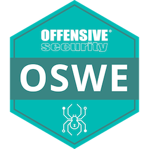
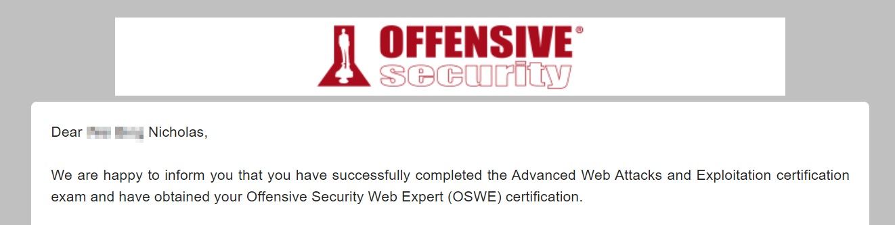

+++
date = '2023-05-12T17:07:19+08:00'
draft = false
title = 'Offensive Security Web Expert (OSWE) Review'
+++

# Precursor to the coursework

I started the OSWE coursework around the middle of 2022. Before that, I had done the following:

- PortSwigger labs - SQLi, XSS, XXE, File upload vulnerabilities, Path traversal, Command Injection, Server-side template injection
- Pentesterlab Pro - Essential badge, couple of Code review labs
- Cleared the eLearnsecurity Professional Penetration Tester (eCPPTv2) certification
- Constantly reading up disclosed bug bounty reports

I also had done many different programming projects in Java, C/C++, Python, PHP, Javascript, SQL. It’s definitely beneficial to have a background in software development and having worked with different programming languages. Even if you don’t have such a background, achieving the OSWE is still possible because it mainly requires you to understand application logic flow in a language agnostic fashion.

For those who lack such experience, I highly recommend picking up Python (freecodecamp youtube) for writing your exploit scripts. Also, learn basic SQL (again, freecodecamp). Work on the PortSwigger labs and also write python scripts that can solve those labs.

Next, create a simple web application using Vanilla PHP with a Model View Controller (MVC) architecture. _vanilla means pure, in this case pure PHP without relying on web frameworks like Laravel_. Your application will be a forum that have the following features:

- Account features - sign up, login, logout
- User features - upload profile image, edit name, email, change password
- Forum - create post (requires user to be authenticated)

You don’t need to make the web application pretty. Just make sure the application logic works. It should include a database of your choice. I recommend SQLite to keep things simple.

Why build this application?

Understanding MVC architecture is important for anyone that is working/exploiting web applications. Building an application gives you a developer perspective, something that is really lacking in many cybersecurity practitioners in my humble opinion. Can’t secure what you don’t understand.

# What is OSWE about?

This is my take after finishing the course and achieving the certification. OSWE mainly focuses on secure code review of large application code bases. Web security is an evolving field, OSWE doesn’t cover the latest web exploitation techniques, but it does give you insights to why certain vulnerabilities exist by reviewing the code.

The course includes many exercises in reviewing applications from different technology stacks and frameworks like PHP, Python, NodeJS, Java, C#, PostgreSQL, MSSQL, etc.

The practical exam is 47 hours 35 minutes where your goal is to get at least 85 out of 100 points. The objective is to write a single exploit script per target that will exploit the web application from pre-authentication to post-authentication and to get a reverse shell connection back to your listener.

# Making full use of the coursework

Depending on your duration of lab access, try to complete at least 85% of the coursework, including the extra miles (unguided labs). The extra miles are labs that don’t have any solutions from the provided coursework documents. They are the best way to test your understanding in the methodology taught.

Remember, you are not here to be a script kiddie. Web exploitation is not about spraying payloads, hoping that one of them gets triggered. Always apply a first principle mindset into why this vulnerability can be triggered. Peel the layers, find out the root cause and retrace back your steps to the initial point of entry.

You are provided with the source code, so use this to build your intuition of identifying vulnerabilities.

# Taking the exam

I recommend to do the following:

- Have your template scripts for different vulnerabilities
- Notes on how to set up your debugging environment, like using VSCode debugger, enabling logging on Web Application Services such as Database logging, decompiling binaries/packages.
- Notes on the different quirks of different programming languages (e.g. string concatenation in PHP vs Python)

Lastly, have a strategy/methodology in how you want to approach the target. My strategy is to look for files that list all the routes. Take note of which requires authentication and not. Review pre-authentication routes logic flow to see how you can exploit them to get you a user session. It’s all about the sources and sinks (iykyk).

Always aim for low-hanging fruits and test them using Burp. I won’t bother with scripting unless I manage to get one vulnerability that takes me closer to the goal of getting a user session. Take note of all vulnerabilities you found because you will most probably have to chain them.

Know what parameters you can control, observe how they are being processed/filtered/sanitized as they are passed to other functions. Again, it’s better to use a breadth first search strategy and only a depth first search once you manage to obtain significant progress. Understanding the rough sense of how the application is structured will give you a better advantage as time passes, as compared to just hitting on one section of the code in the beginning.

The holy grail that determines if you can pass or not: debugging (breakpoints, function stack traces) and logging (SQL, Web server)

Throughout the course, you will notice that some vulnerabilities require you to automate, for example blind SQL injection. The automation takes time to run and you don’t want to keep on running it while building the final exploit chain. Simply hard code the required exfiltrated data from the Blind SQL injection so that you don’t have to wait for it to process again. Of course, before you submit your script, you want to comment out/disable the hard coded data in the script and test if the entire script succeeds.

# Closing remarks

Although OSWE doesn’t cover the latest and greatest web exploitation techniques, it does help you to understand why certain web vulnerabilities exist. It also removes the fear that many cyber security professionals have which is to look at code.

With that said, does this course make me a Web Security Expert? I will honestly say no. Not to discredit the value of the course but a course that typically spans across 30-90 days can only cover so much.

